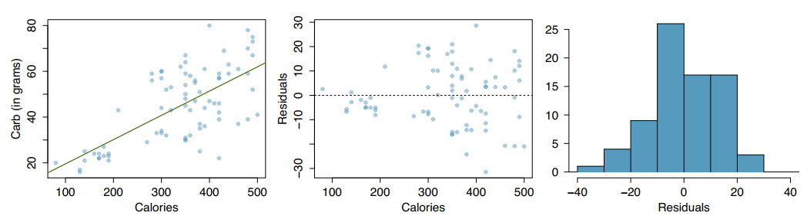
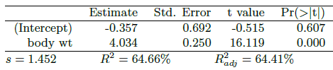
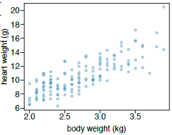
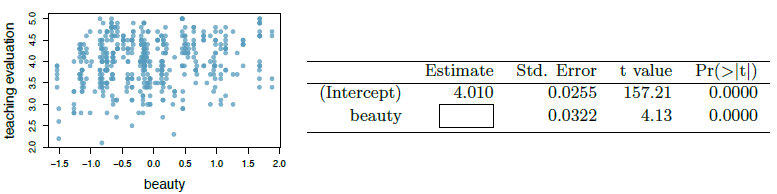
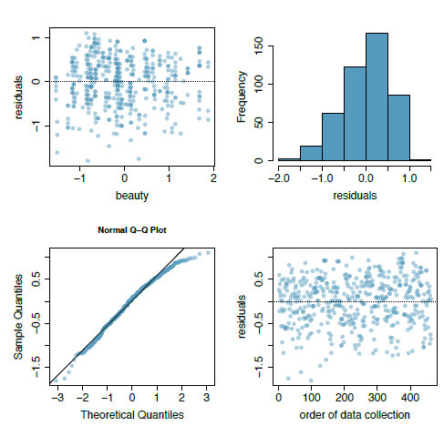

```{r setup, include=FALSE}
knitr::opts_chunk$set(echo = T, warning = F, message = F)
```

## 7.24 Nutrition at Starbucks, Part 1.
The scatterplot below shows the relationship between the number of calories and amount of carbohydrates (in grams) Starbucks food menu items contain. Since Starbucks only lists the number of calories on the display items, we are interested in predicting the amount of carbs a menu item has based on its calorie content.

(a) Describe the relationship between number of calories and amount of carbohydrates (in grams) that Starbucks food menu items contain.\
(b) In this scenario, what are the explanatory and response variables?\
(c) Why might we want to fit a regression line to these data?\
(d) Do these data meet the conditions required for fitting a least squares line?

### (a) Solution
There is a small, positive correlation between number of calories and amount of carbs.

### (b) Solution
The explanatory variable is the number of calories, and the response variable is the amount of carbohydrates.

### (c) Solution
We can fit a regression line to predict the amount of carbs a food item will have based on the number of calories.

### (d) Solution
From section 7.7.2, there are four conditions for fitting a least squares line: Linearity, Nearly normal residuals, Constant variability, and Independent observations.
There is a small linear relationship. The histogram of residuals is close enough to be nearly normal. Constant variability may be the biggest issue; the residuals in the middle plot are not really clustered around the middle line.

## 7.26 Body measurements, Part III.
Exercise 7.15 introduces data on shoulder girth and height of a group of individuals. The mean shoulder girth is 107.20 cm with a standard deviation of 10.37 cm. The mean height is 171.14 cm with a standard deviation of 9.41 cm. The correlation between height and shoulder girth is 0.67.

(a) Write the equation of the regression line for predicting height.\
(b) Interpret the slope and the intercept in this context.\
(c) Calculate $R^2$ of the regression line for predicting height from shoulder girth, and interpret it in the context of the application.\
(d) A randomly selected student from your class has a shoulder girth of 100 cm. Predict the height of this student using the model.\
(e) The student from part (d) is 160 cm tall. Calculate the residual, and explain what this residual means.\
(f) A one year old has a shoulder girth of 56 cm. Would it be appropriate to use this linear model to predict the height of this child?

### (a) Solution
The formula for the regression line is: $y = \beta_0 +\beta_1 \times x$.\
From equation 7.12, $b_1 = \frac{s_y}{s_x}R$.\
From equation 7.15, $y - y_0 = b_1(x - x_0)$.\
$x_0 = 107.2, \quad y_0 = 171.14$.\
$s_x = 10.37, \quad s_y = 9.41$.\
$R = 0.67$. 

```{r 7.26a}
x0 <- 107.2
y0 <- 171.14

sx <- 10.37
sy <- 9.41
r <- 0.67

b1 <- (sy / sx) * r

b0 <- y0 - (b1 * x0)
```
$y = `r b0` + `r b1`\times x$.

### (b) Solution
$\widehat{height} = `r b0` + `r b1`\times \text{shoulder girth}$.\
The slope tells us that each centimeter of shoulder girth increases height by 0.61 centimeters.\
The intercept tells us that a (hypothetical) shoulder girth of 0 would mean a height of $\approx 106$ centimeters.

### (c) Solution
$R^2 = (0.67)^2 = `r r^2`$.\
44.89% of the variation in height can be explained by our model.

### (d) Solution
Using the equation from part (a): $\widehat{height} = `r b0` + `r b1` \times 100 = `r b0 + b1 * 100`$.

### (e) Solution
Equation for residuals: $e_i = y_i - \hat{y}_i$.\
$e_i = 160 - 166.7625805 = -6.762581$.\
A negative value tells us that our model overestimated the actual height.

### (f) Solution
Our model only covers shoulder girth in the range of 85-135 cm. A value of 56 is way outside our range, so it would not be appropriate to use our model to predict the height of this child.

## 7.30 Cats, Part I.
The following regression output is for predicting the heart weight (in g) of cats from their body weight (in kg). The coeffcients are estimated using a dataset of 144 domestic cats.

 

(a) Write out the linear model.\
(b) Interpret the intercept.\
(c) Interpret the slope.\
(d) Interpret $R^2$.\
(e) Calculate the correlation coeffcient.

### (a) Solution
$\widehat{heart \ weight} = -0.357 + 4.034 \times \text{body weight}$.

### (b) Solution
If a cat weighed 0 kg, they'd have a heart weight of -0.357.

### (c) Solution
For every kilogram of body weight, the heart weight increases by just over 4 times.

### (d) Solution
$R^2$ tells us that 64.66% of the variability in heart weight can be explained by our linear model.

### (e) Solution
The correlation coefficient is given by $R$. \
$\sqrt{R} = \sqrt{0.6466} = `r sqrt(0.6466)`$.

## 7.40 Rate my professor.
Many college courses conclude by giving students the opportunity to evaluate the course and the instructor anonymously. However, the use of these student evaluations as an indicator of course quality and teaching effectiveness is often criticized because these measures may reflect the influence of non-teaching related characteristics, such as the physical appearance of the instructor. Researchers at University of Texas, Austin collected data on teaching evaluation score (higher score means better) and standardized beauty score (a score of 0 means average, negative score means below average, and a positive score means above average) for a sample of 463 professors.24 The scatterplot below shows the relationship between these variables,
and also provided is a regression output for predicting teaching evaluation score from beauty score.



(a) Given that the average standardized beauty score is -0.0883 and average teaching evaluation score is 3.9983, calculate the slope. Alternatively, the slope may be computed using just the information provided in the model summary table.\
(b) Do these data provide convincing evidence that the slope of the relationship between teaching evaluation and beauty is positive? Explain your reasoning.\
(c) List the conditions required for linear regression and check if each one is satisfied for this model based on the following diagnostic plots



### (a) Solution
$y = \beta_0 +\beta_1 \times x \quad \to \quad 3.9983 = 4.010 + \beta_1 \times -0.0883$.\
$\beta_1 = \frac{3.9983 - 4.010}{-0.0883} \quad \to \quad \beta_1 = `r (3.9983 - 4.010) / -0.0883`$.

### (b) Solution
Yes, the slope is positive, so there is a positive relationship. Furthermore, we could set up a hypothesis test and find the p-value, which would be nearly 0.

### (c) Solution
As mentioned in the first problem, there are four conditions for fitting a least squares line: Linearity, Nearly normal residuals, Constant variability, and Independent observations.
There may be a slight linear relationship, as seen in the scatterplot. From the histogram and Q-Q plot, we can see that the residuals are nearly normal. The scatterplot does have constant variability. Lastly, independence can be assumed. Since all the conditions have been satisfied, the model is a good fit.